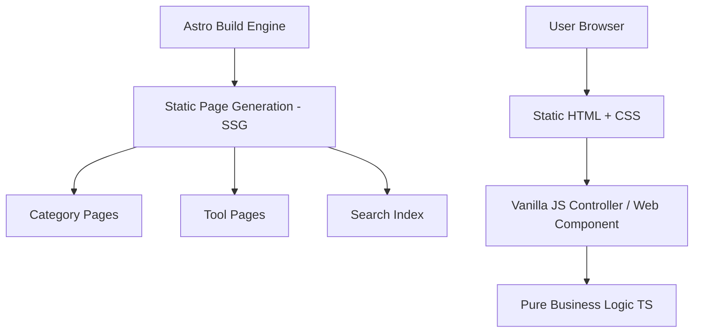

# Architecture Specification - Lowkeydevs

This document outlines the architectural patterns and design decisions for the **Lowkeydevs** platform. The architecture is optimized for speed, organic SEO, scale, and extremely low maintenance.

---

## 1. Core Architectural Pillars



1. **Static First (SSG)**: Every page, including tool pages and categories, is statically generated at build time. There is no server-side rendering (SSR) runtime requirement. This ensures sub-100ms PageSpeed performance and optimal crawler indexing.
2. **Client-Side Processing Only**: All tool computations occur strictly in the user's browser. We do not transmit user inputs to a backend server. This ensures absolute privacy, instantaneous results, and zero server scaling costs.
3. **Strict Separation of Concerns**:
   - **Business Logic (Pure Functions)**: Zero DOM references, zero browser API dependencies (unless required, e.g., clipboard, file downloads). Written in standard TypeScript and 100% unit-testable.
   - **UI Shell (Astro)**: Statically renders the page structure, SEO meta tags, layout, and educational content.
   - **Interactivity Controller (Vanilla Custom Elements)**: Astro components instantiate native HTML5 Custom Elements to handle user interaction (input events, output rendering, button handlers).

---

## 2. Low-JS & Hydration Strategy

To maintain a perfect Lighthouse score, we enforce a strict JavaScript budget:
- **No Heavy Frameworks**: By default, React, Vue, or Svelte are disallowed for simple utility tools. Interactivity must be driven by vanilla TypeScript and custom elements.
- **Islands of Interactivity (If Needed)**: If a tool requires extremely complex state synchronization (e.g., interactive SVG editor, flowchart maker), a library like Preact or React can be loaded as an Astro Island (`client:visible` or `client:idle`).

---

## 3. Data Flow

For client-side utility tools:
1. The user inputs data (text, file, config toggles).
2. The UI component captures events and passes data to the **Pure Logic** layer.
3. The pure function transforms the input and returns a result payload (or throws a validation error).
4. The UI component renders the result and updates shareable state via URL query parameters (if applicable).

```
[User Input] ---> [UI Custom Element] ---> [Pure Logic Function]
                         ^                          |
                         |                          v
                  [Update View] <--------- [Return Result / Error]
```

---

## 4. The Extensible Tool Registry

To make adding tools simple, we maintain a centralized registry.
Each tool is registered as a TypeScript module inside `src/tools/`.
Astro pages read this registry at build time to dynamically generate routes.

- **Dynamic Routing**: `src/pages/tools/[slug].astro` utilizes Astro's `getStaticPaths()` to query all registered tools and generate individual pages automatically.
- **Search Index**: At build time, a lightweight JSON search index is generated and saved to `public/search-index.json` to power instantaneous, local client-side search.

---

## 5. Security & Privacy

Since all computations happen client-side:
- **Zero Data Leakage**: User logs, raw JSON keys, API keys, passwords, and sensitive text never touch a server.
- **Content Security Policy (CSP)**: Strict CSP settings disabling unsafe eval/inline scripts.
- **No Third-Party Analytics Clutter**: Privacy-respecting, lightweight analytics (e.g., Plausible or Cloudflare Web Analytics) with zero tracking cookies.

